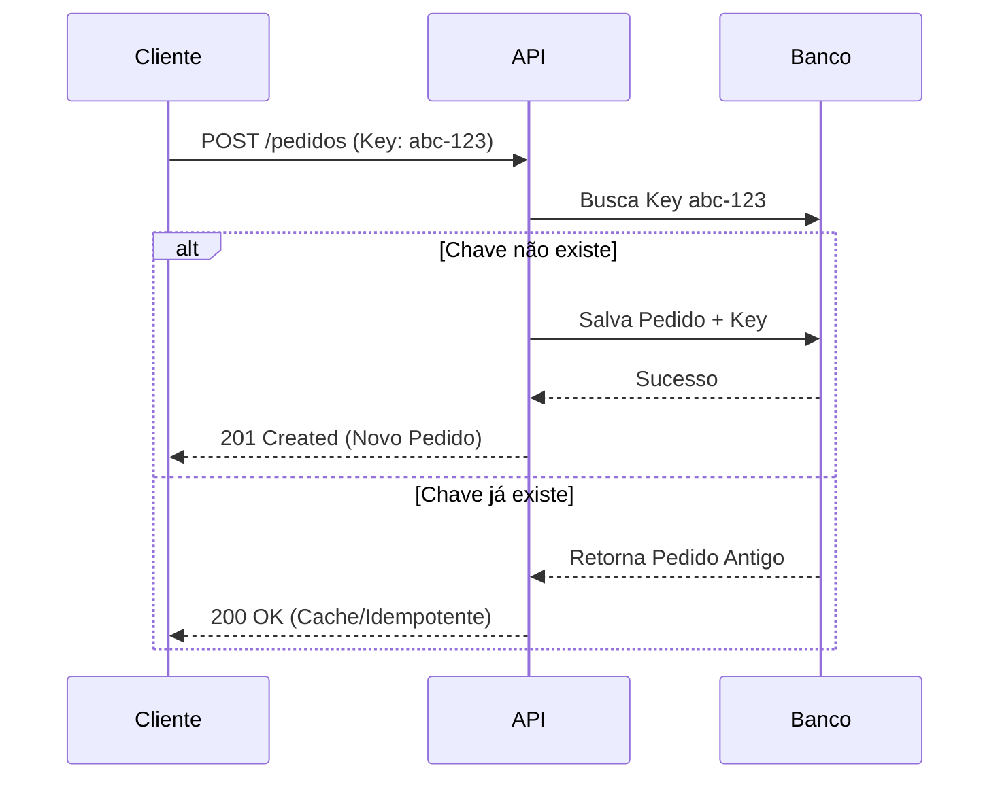

# 🛡️ Pedido Idempotente API


[](https://github.com/lucas907dcomp/pedido-idempotente-api/actions/workflows/maven.yml)

## 📄 Sobre o Projeto
API REST desenvolvida para simular o processamento de pedidos sensíveis com garantia de **Idempotência**.
O projeto previne duplicidade de transações em cenários de falha de rede, retries automáticos ou cliques múltiplos, utilizando uma chave de idempotência (`Idempotency-Key`).

Focado em resolver problemas reais de **duplicidade de pagamentos** e **consistência eventual** em sistemas distribuídos.

---

## 🏛️ Arquitetura

Diferente de aplicações CRUD comuns, aqui o foco é a resiliência do fluxo de dados.
Se uma requisição chegar com uma chave já processada, a API retorna **exatamente o mesmo resultado anterior** (status 200) sem processar novamente.



---

## 🛠 Tecnologias & Bibliotecas

Principais tecnologias utilizadas na construção deste serviço:

* **Java 21** (Versão LTS)
* **Spring Boot 3.5.7** (Framework Base)
* **Spring Data JPA** (Persistência/Hibernate)
* **PostgreSQL 15** (Banco de Dados Relacional)
* **Docker & Docker Compose** (Containerização e Orquestração)
* **Lombok** (Redução de código boilerplate)
* **Logstash Logback Encoder** (Logs Estruturados em JSON para observabilidade)
* **SpringDoc OpenAPI** (Documentação Swagger automatizada)
* **Spring Boot Actuator** (Endpoints de saúde e métricas)
* **GitHub Actions** (Pipeline de CI/CD automatizado)

---

## 🚀 Como Rodar (Getting Started)

### Pré-requisitos
* Docker e Docker Compose instalados.

### Passo 1: Build e Run (Via Docker)
Não é necessário ter Java ou Maven instalados na máquina local, o Docker cuida de todo o processo de build e execução.

```bash
docker-compose up --build
```

A aplicação estará rodando em: `http://localhost:8080`

---

## 🔌 Endpoints & Exemplos

| Método | Rota | Descrição |
|---|---|---|
| `POST` | `/pedidos` | Cria um pedido (Requer header `Idempotency-Key`) |
| `GET` | `/pedidos/{id}` | Busca detalhes de um pedido |
| `GET` | `/actuator/info` | Informações da Build e Versão |
| `GET` | `/actuator/health` | Saúde da aplicação |

### Exemplo de Requisição (CURL)
```bash
curl -X POST http://localhost:8080/pedidos \
  -H "Content-Type: application/json" \
  -H "Idempotency-Key: unique-key-123" \
  -d '{"produto": "Notebook", "quantidade": 1, "valor": 3500.00}'
```

---

## 📚 Documentação & Links

* **Swagger UI (Visual):** [http://localhost:8080/swagger-ui/index.html](http://localhost:8080/swagger-ui/index.html)
* **OpenAPI JSON:** [http://localhost:8080/v3/api-docs](http://localhost:8080/v3/api-docs)
* **Repositório:** [https://github.com/lucas907dcomp/pedido-idempotente-api](https://github.com/lucas907dcomp/pedido-idempotente-api)

---

## 📦 Versionamento

**1.0.0** - Versão inicial com suporte completo a idempotência e containerização.

---

## 👨‍💻 Autores

* **Lucas Aragão** - *Java Backend Developer*

Sinta-se à vontade para seguir no GitHub e conectar-se!
Obrigado pela visita e *happy coding*! 🚀