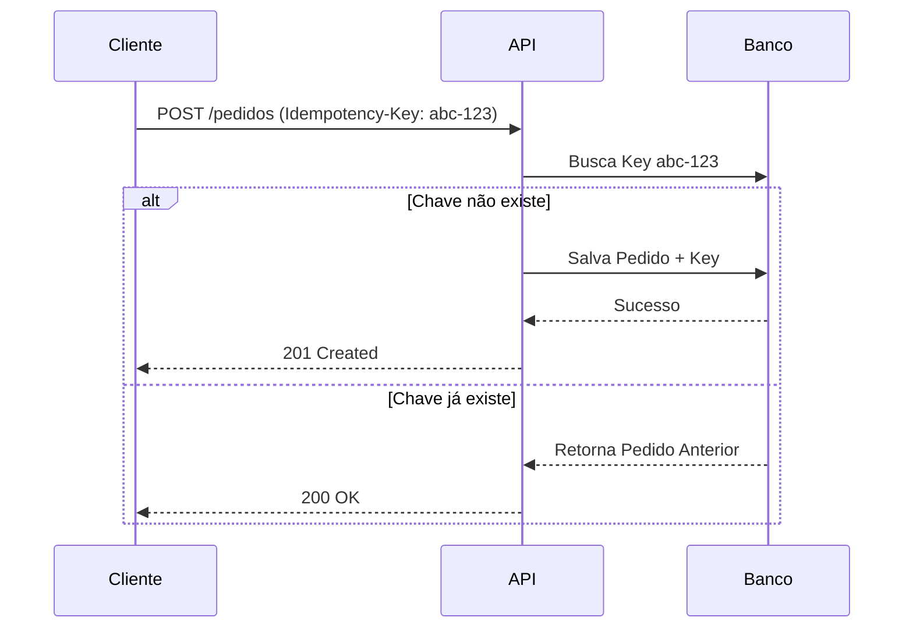

# 🛡️ Pedido Idempotente API


[](https://github.com/lucas907dcomp/pedido-idempotente-api/actions/workflows/maven.yml)

---

## 📄 Sobre o Projeto
API REST desenvolvida para simular o processamento de pedidos sensíveis com **garantia de Idempotência**, evitando duplicidade em cenários como falhas de rede, retries automáticos e múltiplos cliques.

Ela assegura que **a mesma requisição, com a mesma Idempotency-Key, sempre retorna o mesmo resultado**, garantindo consistência e segurança em fluxos críticos como pagamentos e pedidos.

---

## 🔍 Por que Idempotência?
Em arquiteturas distribuídas, falhas acontecem — e sem idempotência, elas geram:

- pagamentos duplicados  
- pedidos criados repetidamente  
- inconsistência de estoque  
- perda de confiabilidade do sistema  

✨ **Com idempotência, o mesmo pedido nunca é processado duas vezes.**

---

## ⚙️ Funcionalidades
- ✔️ Idempotência completa via `Idempotency-Key`
- ✔️ Persistência do histórico de requisições
- ✔️ Retorno consistente em retries
- ✔️ Logs estruturados em JSON (padrão enterprise)
- ✔️ Documentação OpenAPI + Swagger UI
- ✔️ Observabilidade com Spring Actuator
- ✔️ Docker + Docker Compose
- ✔️ CI/CD com GitHub Actions
- ✔️ Código limpo seguindo boas práticas

---

## 🏛️ Arquitetura



---

## 🛠 Tecnologias & Bibliotecas

As principais tecnologias utilizadas na construção deste serviço:

- **Java 21** — versão LTS, mais moderna e performática  
- **Spring Boot 3.5.7** — framework principal  
- **Spring Web** — API REST  
- **Spring Data JPA (Hibernate)** — persistência  
- **PostgreSQL 15** — banco relacional  
- **Docker & Docker Compose** — containerização  
- **Spring Boot Actuator** — saúde, métricas e info da aplicação  
- **SpringDoc OpenAPI** — documentação Swagger automática  
- **Logstash Logback Encoder** — logs estruturados em JSON  
- **Lombok** — redução de boilerplate  
- **GitHub Actions** — pipeline CI/CD automatizado  

---

## 🚀 Como Rodar

### 1️⃣ Pré-requisitos
- Docker instalado

### 2️⃣ Subir a aplicação

```bash
docker-compose up --build
```
A aplicação ficará disponível em:
👉 http://localhost:8080

---
## 🔌 Endpoints

| Método | Rota            | Descrição                                                |
|--------|------------------|----------------------------------------------------------|
| POST   | `/pedidos`       | Criação com idempotência (`Idempotency-Key`)            |
| GET    | `/pedidos/{id}`  | Consulta de pedido                                      |
| GET    | `/actuator/info` | Informações da build                                    |
| GET    | `/actuator/health` | Saúde da aplicação                                   |

---

### 📚 Documentação

- **Swagger UI:** http://localhost:8080/swagger-ui/index.html  
- **OpenAPI JSON:** http://localhost:8080/v3/api-docs
- **Repositório GitHub:** https://github.com/lucas907dcomp/pedido-idempotente-api 

---

## 🧪 Exemplo de Requisição (cURL)

```bash
curl -X POST http://localhost:8080/pedidos \
  -H "Content-Type: application/json" \
  -H "Idempotency-Key: unique-key-123" \
  -d '{"valor": 3500.00}'
```

---

## 📦 Versionamento

**1.0.0** — Versão inicial funcional com suporte completo a idempotência e containerização.

---

## 👨‍💻 Autor

**Lucas Aragão** — Backend Developer (Java / Spring)  
📩 Conecte-se comigo!  

